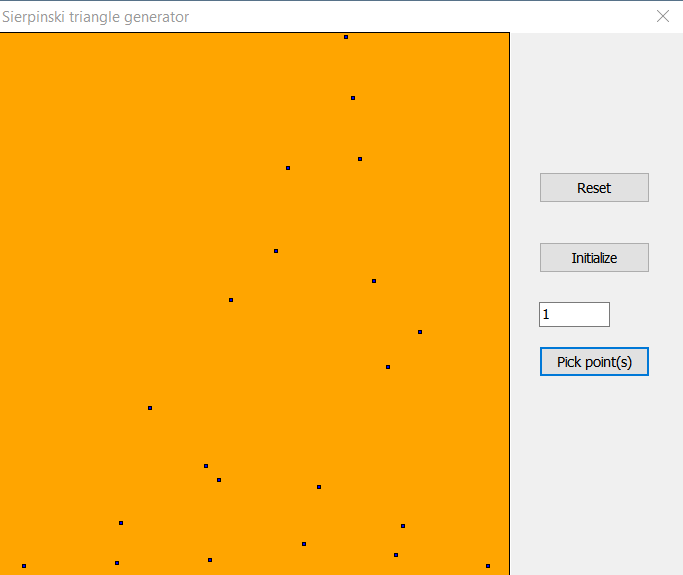
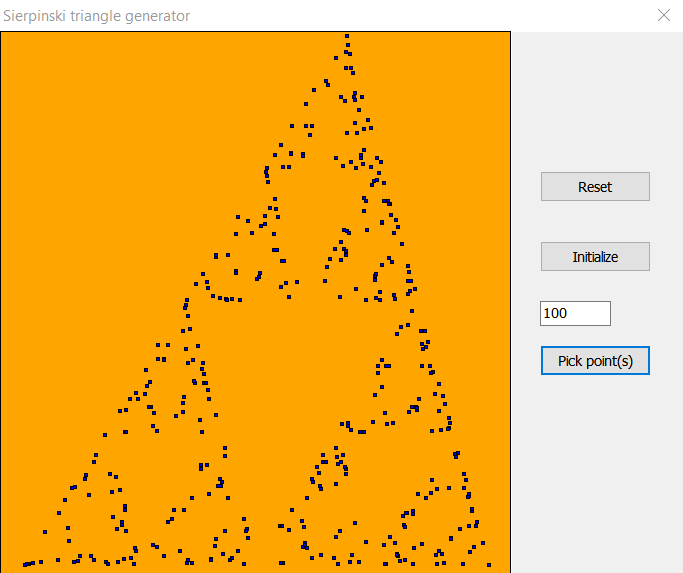
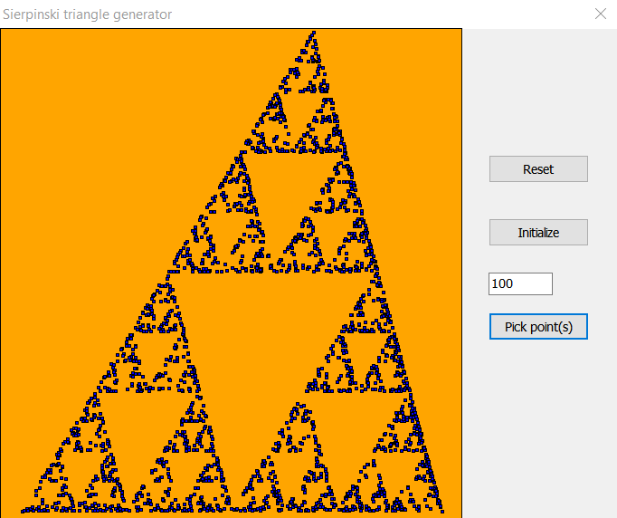
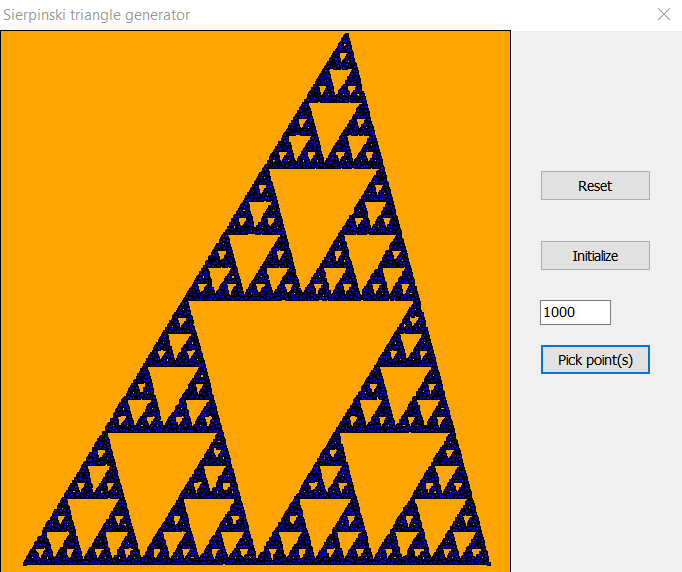

# SierpinskiTriangleGenerator
The [sierpiński triangle](https://en.wikipedia.org/wiki/Sierpi%C5%84ski_triangle) is a type of [fractal](https://en.wikipedia.org/wiki/Fractal) consisting of triangles composed of triangles in an infinite recursive manner.
In this repository a small program for generating them is presented.
The algorithm is quite simple, consisting of only three rules/steps, which result in the sophisticated-looking recurring pattern of the sierpiński triangle.
It is a cool way to show how non-obvious complexity can follow from simple rules, which is known as emergent behaviour.

## The algorithm
1. Pick three random points (these are the vertices of the main triangle)
2. Choose a random point somewhere within the main triangle.
3. Mark the midway point between a randomly chosen vertex and the point found in step #2
4. Repeat step 2-3 until you are satisfied with the picture

## Visuals
First, we pick three random points 

Then, we pick points according to the algorithm outlined above. First, it looks random 

But after more points a pattern emerges

Now, the pattern is clear 

And the final product is 

